# Modelo de datos propuesto

**Enfoque:** extender los modelos Django actuales con migraciones aditivas. PostgreSQL es la autoridad. Los nombres finales pueden adaptarse a las apps existentes; las invariantes no son opcionales.

## 1. Decisiones de modelado

- `Company` continúa representando la empresa legal/emisora y es la raíz de aislamiento operativo.
- `User` sigue siendo identidad de acceso; un vendedor es un perfil laboral, no un tipo rígido de usuario.
- `ClientProfile` se migra hacia una identidad de cliente separada del login y perfiles fiscal/comercial.
- `Order` puede evolucionar a `Sale`/pedido sin copiar todo el módulo.
- Factura, nota de crédito y nota de débito son variantes del mismo agregado fiscal; las notas no requieren tablas duplicadas, sino tipo y asociaciones explícitas.
- Líneas, impuestos, cliente, vendedor, precios y configuración se guardan como snapshots al cerrar el borrador.
- Stock y cuenta corriente se construyen con movimientos append-only; los saldos son proyecciones.
- Certificados y claves privadas no se almacenan en estas tablas: sólo referencia segura y metadatos.

## 2. Diagrama relacional resumido

```mermaid
erDiagram
    COMPANY ||--o{ SELLER_PROFILE : employs
    AUTH_USER ||--o{ SELLER_PROFILE : identifies
    AUTH_USER ||--o{ USER_ROLE : receives
    ROLE ||--o{ USER_ROLE : grants
    ROLE ||--o{ ROLE_PERMISSION : includes
    PERMISSION ||--o{ ROLE_PERMISSION : defines

    CUSTOMER ||--|| CUSTOMER_TAX_PROFILE : has
    CUSTOMER ||--o{ CUSTOMER_COMPANY : operates_in
    COMPANY ||--o{ CUSTOMER_COMPANY : owns_relation
    CUSTOMER_COMPANY ||--o{ CUSTOMER_SELLER_ASSIGNMENT : assigned
    SELLER_PROFILE ||--o{ CUSTOMER_SELLER_ASSIGNMENT : manages
    CUSTOMER ||--o{ ARCA_CUSTOMER_LOOKUP : queried

    PRODUCT ||--o| PRODUCT_FISCAL_PROFILE : taxed_as
    UNIT_OF_MEASURE ||--o{ PRODUCT_FISCAL_PROFILE : measures
    COMPANY ||--o{ PRICE_LIST : owns
    PRICE_LIST ||--o{ PRICE_LIST_ITEM : prices
    PRODUCT ||--o{ PRICE_LIST_ITEM : listed
    PRICE_LIST_ITEM ||--o{ PRICE_HISTORY : versions

    CUSTOMER_COMPANY ||--o{ SALE : buys
    SELLER_PROFILE ||--o{ SALE : sells
    SALE ||--o{ SALE_ITEM : contains
    PRODUCT ||--o{ SALE_ITEM : snapshots

    SALE ||--o{ INVOICE : originates
    INVOICE ||--o{ INVOICE_ITEM : contains
    INVOICE ||--o{ INVOICE_TAX : totals
    INVOICE ||--o{ INVOICE_ASSOCIATION : adjusts
    INVOICE ||--|| INVOICE_AUTHORIZATION : authorizes
    INVOICE_AUTHORIZATION ||--o{ ARCA_AUTHORIZATION_ATTEMPT : attempts
    INVOICE ||--o{ INVOICE_ARTIFACT : renders
    FISCAL_POINT_OF_SALE ||--o{ INVOICE : numbers

    CUSTOMER_COMPANY ||--o{ PAYMENT : pays
    PAYMENT ||--o{ PAYMENT_TENDER : uses
    PAYMENT ||--o{ PAYMENT_APPLICATION : applies
    INVOICE ||--o{ PAYMENT_APPLICATION : settled_by
    CUSTOMER_COMPANY ||--o{ ACCOUNT_MOVEMENT : ledger

    WAREHOUSE ||--o{ STOCK_BALANCE : holds
    PRODUCT ||--o{ STOCK_BALANCE : stocked
    PRODUCT ||--o{ STOCK_RESERVATION : reserves
    PRODUCT ||--o{ STOCK_MOVEMENT : moves

    SELLER_PROFILE ||--o{ COMMISSION_EVENT : earns
    INVOICE ||--o{ COMMISSION_EVENT : triggers
    COMMISSION_RULE ||--o{ COMMISSION_EVENT : calculates
    COMMISSION_SETTLEMENT ||--o{ COMMISSION_EVENT : settles
```



## 3. Empresas, usuarios, vendedores y permisos

### `Company` — existente, extender

Campos principales: `id`, razón legal, CUIT normalizado, condición fiscal, domicilio, zona horaria, moneda base, estado, timestamps.

Restricciones:

- `UNIQUE(cuit_normalized)` cuando tenga CUIT;
- `UNIQUE(slug)`;
- `CHECK(cuit_normalized ~ '^[0-9]{11}$')` en PostgreSQL;
- no hard-delete si tiene documentos fiscales.

### `SellerProfile` — nuevo

| Campo | Tipo/nota |
|---|---|
| `id` | UUID o bigint |
| `company_id` | FK `Company`, obligatorio |
| `user_id` | FK `auth.User`, obligatorio |
| `code` | código comercial |
| `display_name` | snapshot operativo |
| `supervisor_id` | FK nullable a `SellerProfile` |
| `max_discount_pct` | nullable; límite propio |
| `can_sell_below_cost` | preferible como permiso, no sólo booleano |
| `active_from`, `active_until` | vigencia |
| `created_at`, `updated_at` | trazabilidad |

Restricciones: `UNIQUE(company_id, user_id)`, `UNIQUE(company_id, code)`, check de descuento entre 0 y 100.

### Autorización — nuevos o evolución de grupos

- `Role(id, company_id nullable, code, name, is_system, version, active)`.
- `Permission(id, code unique, resource, action, scope_kind, is_critical)`.
- `RolePermission(role_id, permission_id, constraints_json)`.
- `UserRole(user_id, role_id, company_id, valid_from, valid_until, granted_by_id)`.
- `UserPermission(user_id, permission_id, company_id, effect allow/deny, constraints_json, valid_until, granted_by_id)`.

Índices/constraints:

- unique activo por rol/permiso;
- índices `(user_id, company_id, valid_until)` y `(role_id, permission_id)`;
- un `deny` explícito prevalece;
- cambios críticos escriben auditoría y revocan caches/sesiones según política.

Los permisos enumerados por el requerimiento son códigos, por ejemplo `clientes.ver_propios`, `facturas.autorizar`, `productos.ver_costos`. `scope_kind` no se infiere de la UI.

## 4. Clientes

### `Customer` — nuevo destino de `ClientProfile`

Identidad no dependiente de login: `id`, `tax_id_type`, `tax_id_normalized`, nombre canónico, tipo de persona, estado, `portal_user_id` nullable, `created_by_user_id`, timestamps, `deactivated_at`.

Restricción recomendada: `UNIQUE(tax_id_type, tax_id_normalized)` para identificadores presentes. Si en el futuro una instalación aloja empresas no relacionadas legalmente, agregar `tenant_id` y usar `UNIQUE(tenant_id, type, value)`; no relajar la unicidad en código.

### `CustomerTaxProfile`

Relación 1:1 con `Customer`:

- razón social, nombre/apellido;
- tipo de persona y estado de clave;
- condición IVA normalizada y `arca_iva_condition_id`;
- condición de monotributo;
- domicilio fiscal estructurado;
- actividades e impuestos normalizados en tablas hijas o JSON versionado;
- `source`, `verified_status`, `queried_at`, `valid_as_of`;
- `raw_response_ref` opcional a storage cifrado; nunca token/sign;
- `normalized_payload`, `schema_version`, hash de respuesta.

Tablas hijas opcionales: `CustomerTaxActivity`, `CustomerActiveTax`, `CustomerTaxCharacterization`, todas con vigencia y clave de fuente.

### `CustomerCompany`

Evolución del modelo existente. Guarda relación comercial por empresa:

- `customer_id`, `company_id`;
- nombre comercial, email comercial, teléfono, contacto;
- dirección de entrega y administrativa separadas;
- lista de precios, descuento habitual, condición de pago;
- límite de crédito, días de vencimiento;
- estado activo/bloqueado, motivo, observaciones;
- `created_by_user_id`, timestamps y lock/version.

Restricción: `UNIQUE(company_id, customer_id)`. Índices por nombre comercial, estado, lista y vendedor activo.

### `CustomerSellerAssignment`

Conserva historia: `customer_company_id`, `seller_profile_id`, `valid_from`, `valid_until`, `assigned_by_user_id`, motivo.

Restricción parcial PostgreSQL: un solo registro activo (`valid_until IS NULL`) por `customer_company_id`. Reasignar cierra el anterior; no lo sobrescribe.

### `ArcaCustomerLookup`

`id`, empresa/actor, CUIT consultado, idempotency key, servicio/método/ambiente, estado, request sanitizado, response normalizada, hash, códigos de error, `queried_at`, `expires_at`, correlation ID y duración.

Restricciones:

- `UNIQUE(company_id, idempotency_key)`;
- índice `(tax_id_normalized, queried_at DESC)`;
- no guardar certificado, clave, token o sign;
- retención y acceso limitados por PII.

## 5. Catálogo, fiscalidad y pricing

### `Product` — conservar

Conservar ID, SKU, URLs, imagen y relaciones. Agregar soft delete (`deactivated_at`) y, si el catálogo pasa a ser por empresa, una tabla de overlay en vez de duplicar productos.

### `UnitOfMeasure`

`id`, código interno único, descripción, código fiscal si aplica, decimales permitidos, activo.

### `ProductFiscalProfile`

`product_id` 1:1, `invoice_description`, `unit_of_measure_id`, `currency`, `tax_treatment`, `vat_rate`, clasificación, `valid_from`, `validated_by`, `updated_at`.

No usar una tasa por tipo de factura como reemplazo. El cálculo toma el perfil vigente y lo copia al ítem.

### Precios

- `PriceList`: empresa, nombre, moneda, modo `NET/GROSS`, canal, restringida, vigencia, activa.
- `PriceListItem`: lista, producto/variante, monto, `valid_from`, `valid_until`, versión, creador.
- `CustomerPriceAgreement`: cliente-empresa, producto/categoría/lista, precio o descuento, vigencia, prioridad.
- `PriceHistory`: evento append-only con valor anterior/nuevo, moneda, neto/final, causa, actor y timestamp.
- `CostHistory`: extender el historial existente con empresa/moneda/fuente/vigencia.
- `DiscountPolicy`: empresa, rol/vendedor/categoría/producto, máximo, requiere aprobación, vigencia.

Restricciones:

- no solapamiento de vigencias para la misma lista/producto mediante exclusion constraint o servicio + lock;
- `CHECK(amount >= 0)`, moneda ISO de 3 caracteres;
- unique de versión/lista/producto;
- índices de vigencia y búsqueda por producto.

## 6. Ventas y documentos comerciales

### `Sale` — evolución de `Order`

Campos nuevos esenciales:

- `company_id`, `customer_company_id`;
- `seller_profile_id` (responsable comercial);
- `created_by_user_id`, `approved_by_user_id`;
- estado, canal, moneda, condición de pago;
- lista/precio policy snapshot;
- subtotal neto, descuento, impuestos, total;
- `idempotency_key`, `version`, timestamps;
- snapshots de cliente y vendedor.

`assigned_to_id` puede mantenerse para operación, pero no reemplaza `seller_profile_id`.

Estados sugeridos: `DRAFT`, `PENDING_APPROVAL`, `CONFIRMED`, `FULFILLING`, `DELIVERED`, `CANCELLED`, `INVOICED`. Sólo transiciones declaradas.

### `SaleItem`

Evolución de `OrderItem`. Debe incluir snapshot:

- producto/variante nullable;
- código, descripción comercial y fiscal;
- cantidad y unidad;
- lista y versión de precio;
- precio neto/bruto, moneda/cotización;
- descuento porcentual/monto y aprobación;
- costo unitario snapshot restringido;
- tratamiento/tasa IVA;
- neto, IVA, otros tributos, total;
- vendedor snapshot si la línea puede tener vendedor distinto.

### Presupuestos, pedidos y remitos

Reutilizar un `CommercialDocument`/`InternalDocument` tipado cuando comparten invariantes, con tablas de líneas snapshot y asociaciones a `Sale`. No duplicar lógica por cada nombre. Los tipos deben configurar presentación y transición; sus efectos de stock/cuenta no se disparan al crear un registro sino al evento de negocio elegido.

## 7. Facturación

### `Invoice`

Destino endurecido de `FiscalDocument`.

| Grupo | Campos |
|---|---|
| Identidad | `id UUID`, `company_id`, `source_sale_id`, `customer_company_id` |
| Actores | `seller_profile_id`, `created_by_user_id`, `authorized_by_user_id` |
| Fiscal | tipo/código ARCA, POS, número, fecha, concepto, moneda, cotización |
| Receptor | CUIT/tipo doc, razón, condición IVA ID/desc, domicilio snapshot |
| Totales | neto gravado, no gravado, exento, IVA, tributos, total |
| Estado | estado, versión, observaciones, error normalizado |
| CAE | CAE, vencimiento, fecha autorización |
| Control | `idempotency_key`, `snapshot_hash`, correlation ID |
| Historia | timestamps, `immutable_at`, `adjustment_status` |

Restricciones:

- `UNIQUE(company_id, point_of_sale_id, arca_voucher_type, voucher_number)` si número no nulo;
- `UNIQUE(company_id, idempotency_key)`;
- `UNIQUE(source_sale_id, invoice_purpose, active_version)` según política de parciales;
- checks de totales no negativos salvo tipo/semántica explícita;
- trigger o permisos DB que impidan `UPDATE/DELETE` de campos protegidos si `immutable_at` no es nulo;
- FKs `PROTECT` en POS/configuración; líneas no deben borrarse en cascada luego de autorizar.

Estados:

```text
DRAFT
VALIDATING
PENDING_AUTHORIZATION
AUTHORIZING
AUTHORIZED
AUTHORIZED_WITH_OBSERVATIONS
REJECTED
UNKNOWN_ERROR
REQUIRES_ARCA_QUERY
FULLY_ADJUSTED
PARTIALLY_ADJUSTED
VOIDED_LOCAL_DRAFT
```

`REJECTED` sólo para rechazo definitivo. Un timeout, XML inválido o caída posterior al envío usa `REQUIRES_ARCA_QUERY`.

### `InvoiceItem`

Snapshot obligatorio: línea, código, descripción, unidad, cantidad, vendedor, lista/versión, precio unitario neto/bruto, descuento, costo opcional restringido, tratamiento/tasa IVA, neto, IVA, no gravado, exento, tributos, total y referencia de origen.

### `InvoiceTax`

Una fila por clase/tasa/tributo: `invoice_id`, kind (`VAT`, `OTHER_TAX`, `EXEMPT`, `NON_TAXED`), código ARCA, descripción, base, alícuota, importe, jurisdicción opcional.

Unique `(invoice_id, kind, arca_code, rate)` cuando corresponda.

### `InvoiceAssociation`

Relaciona nota con comprobante original: `adjustment_invoice_id`, `original_invoice_id`, tipo de asociación, monto/ítems afectados, motivo, creador, aprobador y fecha.

Constraints: misma empresa y cliente, original autorizado, tipo compatible, no auto-relación. Validaciones acumuladas deben ejecutarse con lock.

### Autorización ARCA

- `InvoiceAuthorization`: factura, snapshot hash, estado, número candidato, ambiente, método, fecha inicio/fin, CAE y respuesta normalizada.
- `ArcaAuthorizationAttempt`: número de intento, operation (`SEND`/`QUERY`), request/response sanitizados, HTTP/SOAP status, errores/observaciones, timestamps, resultado e incertidumbre.
- `FiscalSequence`: empresa, POS, tipo, último observado ARCA, próximo candidato local, versión y `last_synced_at`.

Restricciones: intento unique por autorización/número; secuencia unique por empresa/POS/tipo. Ningún payload contiene `token`, `sign`, CMS, certificado o clave.

### `InvoiceArtifact`

`invoice_id`, tipo/copia, storage key, SHA-256, MIME, tamaño, template version, QR payload hash, generado en, estado. Unique `(invoice_id, artifact_type, copy_kind, template_version)` o una única versión legal más copias derivadas.

El archivo se almacena cifrado, privado y versionado. Descargar no vuelve a calcular el documento legal.

## 8. Pagos y cuenta corriente

### `Payment`

Empresa, cliente, fecha, moneda/cotización, total, referencia, estado, idempotency key, creador/aprobador/anulador, motivo y timestamps.

Estados: `DRAFT`, `CONFIRMED`, `PARTIALLY_APPLIED`, `APPLIED`, `VOIDED`, `REVERSED`.

### `PaymentTender`

Una fila por medio: pago, tipo (`CASH`, `TRANSFER`, `CHECK`, `CARD`, `MERCADOPAGO`, `DEPOSIT`, otros configurables), monto, moneda, referencia, metadatos sanitizados. Suma de medios = total del pago.

### `PaymentApplication`

Pago, factura, importe aplicado, fecha, actor, estado. Unique idempotency key; check importe positivo; misma empresa/cliente/moneda o conversión explícita. Permite N:N, parciales y anticipos.

### `AccountMovement`

Ledger append-only: empresa, cliente, fecha, tipo, debe, haber, moneda, vencimiento, documento origen, vendedor snapshot, usuario, observación e idempotency key. Los reversos son nuevas filas asociadas, nunca edición destructiva.

Índices `(company_id, customer_id, occurred_at, id)` y por vencimiento/estado. El saldo se calcula/proyecta; si se materializa, se reconcilia con el ledger.

## 9. Stock

- `Warehouse`: existente, empresa y estado.
- `StockBalance`: unique `(company, warehouse, product, variant)`, `physical`, `reserved`, `version`; disponible = físico - reservado.
- `StockReservation`: venta/línea, cantidad, estado, expiración, idempotency key.
- `StockMovement`: append-only con tipo, cantidad firmada, origen, depósito origen/destino, costo snapshot, actor, timestamp y reversal link.

Estados de reserva: `ACTIVE`, `CONSUMED`, `RELEASED`, `EXPIRED`. Transferencia genera dos movimientos coordinados. Nunca se actualiza `Product.stock` directamente desde una factura; durante transición puede mantenerse como proyección de compatibilidad.

## 10. Comisiones

- `CommissionRule`: empresa, alcance vendedor/producto/categoría/cliente, base (`NET`, `TOTAL`, `MARGIN`, `COLLECTION`), tasa/fórmula versionada, evento de devengamiento, vigencia y prioridad.
- `CommissionEvent`: vendedor, regla/version, factura/pago/nota, base snapshot, monto, moneda, estado, idempotency key.
- `CommissionSettlement`: empresa, vendedor, período, totales, estado, aprobador/pagador y timestamps.

Estados de evento: `ESTIMATED`, `PENDING_COLLECTION`, `CONFIRMED`, `PAID`, `ADJUSTED`, `VOIDED`. Una nota crea evento compensatorio asociado; no edita el original.

No se elige fórmula ni momento hasta responder `QUESTIONS_FOR_USER.md`.

## 11. Configuración fiscal y certificados

- `FiscalConfiguration`: empresa, ambiente, régimen emisor, monedas/conceptos permitidos, feature flags, validado en, versión.
- `FiscalPointOfSale`: existente; agregar códigos/estado observados en ARCA y `last_synced_at`.
- `EnabledVoucherType`: empresa/POS/tipo, vigencia, fuente ARCA.
- `FiscalParameterCache`: método, clave, payload normalizado, vigencia/hash.
- `CertificateReference`: empresa, ambiente, secret-provider, secret-key/reference, fingerprint, subject, serial, válido desde/hasta, estado y rotación; **sin bytes del certificado ni clave privada** si el secret manager los custodia juntos.

## 12. Auditoría, errores y outbox

### `AuditEvent`

Append-only: UUID, empresa, actor, actor vendedor, acción, entidad/ID, timestamp, IP, user-agent reducido, before/after sanitizados, resultado, correlation ID, reason, hash encadenado opcional.

### `SystemError`

Código, componente, severidad, mensaje seguro, correlation ID, entidad, stack cifrado/restringido, estado y timestamps. No duplicar secretos en Sentry.

### `OutboxEvent`

UUID, empresa, aggregate type/ID/version, event type, payload sanitizado, creado, disponible, procesado, intentos y último error. Unique `(aggregate_id, aggregate_version, event_type)`.

### `IdempotencyRecord`

Empresa, actor, endpoint/comando, key, request hash, estado, entity/result reference, response segura, expiración. Reutilizar una key con otro hash devuelve conflicto.

## 13. Ejemplo de snapshot fiscal

Ejemplo conceptual sin datos reales:

```json
{
  "product_code": "SKU-EXAMPLE",
  "description": "Producto facturable",
  "quantity": "2.000",
  "unit_code": "UNI",
  "price_list_code": "MAYORISTA",
  "price_list_version": 7,
  "unit_price_net": "100.00",
  "discount_pct": "5.00",
  "vat_rate": "21.00",
  "net_amount": "190.00",
  "vat_amount": "39.90",
  "total_amount": "229.90",
  "seller_id": "<snapshot-reference>"
}
```

El JSON puede acompañar campos relacionales, pero los importes consultables deben permanecer en columnas `Decimal`, no sólo en JSON.

## 14. Borrado lógico e inmutabilidad

- usuarios, vendedores, clientes, productos, listas y reglas: desactivar/fechar; no borrar si están referenciados;
- borradores sin efectos: hard-delete administrativo posible con auditoría;
- ventas confirmadas: cancelar/revertir, no borrar;
- facturas autorizadas, intentos, artifacts, ledger, stock y comisiones: append-only o reverso explícito;
- PII: anonimización sólo conforme política legal y conservando obligaciones fiscales; no afecta comprobantes legales.

La inmutabilidad se aplica en cuatro capas: servicio de dominio, modelo, permisos DB/trigger y tests. Django Admin directo a modelos fiscales debe estar deshabilitado o ser sólo lectura.

## 15. Estrategia de migración

1. Crear permisos/policies y campos de actor/vendedor nulos.
2. Crear nuevas tablas de cliente; copiar sin alterar `ClientProfile`.
3. Generar reporte de 364 faltantes y 48 grupos duplicados; resolver manualmente.
4. Normalizar CUIT, validar módulo 11 e imponer índice único condicional.
5. Crear perfiles fiscales de producto y marcar incompletos; no inventar IVA/unidad.
6. Versionar precios/costos y backfill con fuente `legacy`.
7. Añadir nuevos snapshots a venta/factura y completar sólo desde evidencia existente.
8. Introducir estado/outbox/idempotencia sin emitir.
9. Migrar los dos documentos fiscales locales como legacy/manual o borrador según su estado; no autorizar.
10. Cambiar lecturas con feature flags y reconciliar conteos/totales.
11. Activar homologación por empresa.
12. Retirar campos legacy sólo en una release posterior con backup probado.

Cada migración de datos debe ser reanudable, por lotes, idempotente, con `--dry-run`, reporte de excepciones y rollback lógico. Las constraints se agregan después de limpiar los datos, preferentemente `NOT VALID`/validación posterior donde PostgreSQL lo permita.
