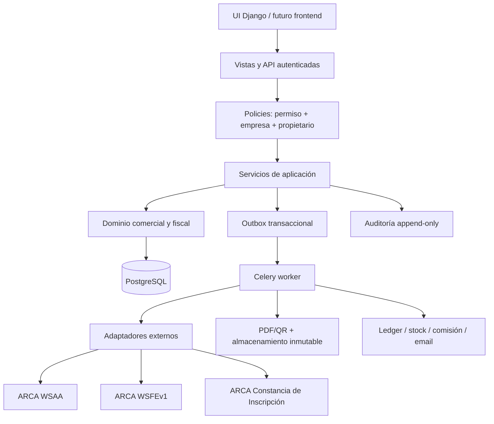

# Plan de integración comercial y facturación electrónica

**Decisión:** evolución incremental del monolito Django; PostgreSQL como autoridad y ARCA encapsulada detrás de adaptadores backend.  
**Regla de salida:** ninguna llamada de producción hasta superar homologación, recuperación, concurrencia, seguridad y reconciliación.

## 1. Arquitectura propuesta

El frontend nunca calcula el total fiscal definitivo, elige un número fiscal, consulta ARCA directamente ni recibe credenciales. Puede presentar una previsualización, pero el backend vuelve a validar y calcular desde datos persistidos.

## 2. Principios

1. **Un solo sistema de registro:** Django/PostgreSQL. El build .NET no puede ser autoridad hasta recuperar su fuente, pruebas y pipeline.
2. **Empresa obligatoria:** toda entidad comercial debe tener `company_id`; toda consulta/mutación se filtra por empresas autorizadas.
3. **Permiso y alcance separados:** permiso de acción más policy de `propio/todos/asignado`.
4. **Snapshots legales:** factura e ítems no dependen de cliente/producto/lista actuales.
5. **Inmutabilidad:** un comprobante autorizado no se edita ni elimina; se corrige con nota asociada.
6. **Idempotencia durable:** clave única desde la orden de emisión hasta cada efecto derivado.
7. **Estado incierto no es rechazo:** ante timeout posterior al envío se consulta ARCA antes de reemitir.
8. **Efectos coordinados:** CAE se confirma localmente y publica eventos en outbox dentro de una transacción.
9. **Separación facturación/cobranza:** pagar no altera importes fiscales.
10. **Migración aditiva:** columnas/tablas nuevas, backfill verificable, doble lectura temporal y feature flags.

## 3. Límites modulares

Los nombres son orientativos; conviene crear paquetes de dominio dentro de Django antes que nuevos microservicios.

| Módulo | Responsabilidad | Base actual |
|---|---|---|
| `identity` | autenticación, estado de usuario, vendedor | `auth.User`, grupos |
| `authorization` | roles, permisos, grants y policies | `core.services.authorization` |
| `customers` | identidad del cliente, fiscal, comercial, asignación | `accounts` |
| `catalog` | maestro de producto, fiscalidad, unidades | `catalog` |
| `pricing` | listas, vigencia, reglas, descuentos, costo | `PriceList*` |
| `sales` | borrador, validación, venta/pedido y snapshots | `orders` |
| `invoicing` | cálculo, factura, notas, estados e inmutabilidad | `FiscalDocument*` |
| `arca` | WSAA, WSFE, padrón, parámetros y recuperación | `arca_client.py` |
| `documents` | PDF, QR, hash, storage, reenvío | `pdf_generator.py` |
| `receivables` | cuenta corriente, pagos y aplicaciones | `accounts` ledger |
| `inventory` | saldos por depósito, reservas y movimientos | `StockMovement` |
| `commissions` | reglas, eventos, ajustes y liquidaciones | Nuevo |
| `audit` | evento sensible sanitizado e inmutable | `AdminAuditLog` |
| `operations` | outbox, jobs, reconciliación, health, alertas | Celery/tasks |

## 4. Módulos a conservar, modificar y crear

### 4.1 Conservar

- catálogo público, URLs e imágenes;
- categorías, marcas y proveedores;
- importadores Excel con previsualización;
- `Company`, `AdminCompanyAccess`, contexto de empresa;
- listas de precios como concepto;
- pedidos/ítems como origen comercial;
- PostgreSQL, Redis, Celery, WeasyPrint y Sentry;
- separación entre documentos internos y fiscales;
- source keys/idempotencia ya presentes en varios flujos.

### 4.2 Modificar

| Área | Cambio mínimo |
|---|---|
| Usuarios | agregar perfil de vendedor; desacoplar cliente de login gradualmente |
| Permisos | pasar de 13 capacidades amplias a permisos por recurso/acción/alcance |
| Vistas | centralizar queryset autorizado y servicio; eliminar lookups globales por PK |
| Clientes | CUIT canónico, snapshots de consultas y separación fiscal/comercial |
| Productos | unidad, moneda, fiscalidad, descripción de factura y soft delete |
| Pricing | vigencia, neto/final, moneda, historia, máximos y autorización |
| Pedidos | vendedor/creador/aprobador, snapshots fiscales y control de versión |
| Fiscal | nuevo estado, idempotencia, recuperación, inmutabilidad y campos completos |
| ARCA | adaptar WSAA/WSFE a contratos actuales y redacción estricta |
| PDF/QR | generar una vez, persistir bytes/hash/versión |
| Cuenta corriente | aplicaciones N:N de pagos y outbox |
| Stock | eliminar efecto al crear borrador fiscal; usar evento configurado |
| Auditoría | append-only, resultado, correlation ID, redacción y cobertura |

### 4.3 Crear

- `SellerProfile` o perfil laboral separado de `User`;
- roles, permisos y asignaciones normalizados o un modelo equivalente auditable;
- `CustomerTaxIdentity`, `CustomerCommercialProfile`, `CustomerSellerAssignment`;
- `ArcaCustomerLookup` y respuesta sanitizada/cifrada según necesidad;
- `UnitOfMeasure`, configuración fiscal de producto y versiones de precio/costo;
- agregado de factura legal y tablas de impuestos/asociaciones;
- solicitud de autorización e intentos sanitizados;
- artefacto documental inmutable;
- aplicaciones de pagos y medios normalizados;
- saldo/reserva/movimiento de inventario por depósito;
- reglas, eventos y liquidaciones de comisión;
- outbox, inbox/idempotency record y jobs de reconciliación;
- auditoría de seguridad y errores operativos estructurados.

## 5. Flujo comercial objetivo

### 5.1 Cliente por CUIT

1. El vendedor ingresa CUIT.
2. Backend normaliza y valida módulo 11.
3. Consulta índice único local sin revelar el detalle a quien no tenga alcance.
4. Si existe, devuelve estado limitado o detalle según policy.
5. Si no existe y tiene permiso, crea una solicitud idempotente al servicio de padrón.
6. Guarda fuente, fecha, estado, identificadores de respuesta y payload sanitizado.
7. El usuario confirma datos fiscales y completa datos comerciales.
8. Crea cliente, relación empresa, asignación de vendedor y evento de auditoría en una transacción.

### 5.2 Venta en borrador

1. Crear borrador con empresa, cliente, vendedor comercial y creador.
2. Resolver lista, vigencia, moneda, condición de pago y reglas.
3. Agregar producto mediante comando backend; no aceptar un total confiado del navegador.
4. Calcular precio, descuentos, impuestos y totales con `Decimal` y reglas versionadas.
5. Si excede límites, rechazar o crear solicitud de aprobación.
6. Congelar snapshot de línea y versión de pricing al confirmar.
7. Presentar resumen de confirmación y token anti-doble-submit.

### 5.3 Emisión de factura

1. Crear `Invoice` en `DRAFT`, separada de ARCA.
2. Validar datos, permisos, habilitación de comprobante y consistencia de totales.
3. Congelar snapshot e idempotency key.
4. Encolar comando de autorización único.
5. Worker toma lock de factura y lock lógico por `company + POS + type`.
6. Sincroniza último autorizado con ARCA y calcula candidato.
7. Persiste intento `SENDING` sin secretos.
8. Envía `FECAESolicitar` una sola vez.
9. Si la respuesta es definitiva, guarda CAE/rechazo/observaciones.
10. Si es incierta, pasa a `REQUIRES_ARCA_QUERY`; no reenvía.
11. `FECompConsultar` recupera el comprobante exacto y compara todos los campos críticos.
12. La transacción de confirmación escribe factura autorizada + evento outbox.
13. Workers idempotentes generan PDF/QR, cuenta corriente, stock/comisión según regla, auditoría y email.

### 5.4 Correcciones

La factura original permanece. Una nota se crea desde una o más líneas originales, con motivo, creador y aprobador. El backend valida empresa, cliente, clase, montos acumulados, comprobante asociado y permiso. Sus efectos son eventos compensatorios; nunca borrados o actualizaciones retrospectivas.

### 5.5 Cobranza

Registrar `Payment` y uno o varios medios; aplicar mediante `PaymentApplication` a varias facturas. Un remanente crea crédito/anticipo. Las aplicaciones y anulaciones escriben movimientos contables idempotentes; no modifican la factura.

## 6. Interfaz de facturación

La pantalla puede seguir siendo Django Templates inicialmente.

Bloques recomendados:

1. cabecera con empresa y ambiente visible;
2. cliente/buscador CUIT y estado fiscal;
3. vendedor comercial, creador y condición de pago;
4. punto de venta/tipo permitidos calculados por backend;
5. lista de precios y moneda;
6. grilla de productos con unidad, cantidad, precio, descuento, IVA y totales;
7. tributos y observaciones;
8. resumen neto/no gravado/exento/IVA/tributos/total;
9. vista previa inmutable de confirmación;
10. botón de emisión de un solo uso, deshabilitado al enviar;
11. seguimiento de estado por polling seguro o eventos;
12. descarga/reenvío desde el artefacto guardado, sin nuevo CAE.

La UI muestra por qué una operación fue bloqueada, pero no conoce secretos ni decide permisos.

## 7. Permisos objetivo

Mantener roles como plantillas y permisos efectivos como grants versionados. Un rol no debe ser una condición directa en la lógica de negocio.

Dimensiones de autorización:

- acción: `facturas.autorizar`;
- empresa: conjunto de `company_id` permitidas;
- alcance: propio, clientes asignados, equipo, todos;
- condición: límite de descuento, monto o doble aprobación;
- vigencia: desde/hasta y revocación inmediata.

Permisos mínimos: los enumerados en el requerimiento, con separación adicional para `facturas.configurar`, `facturas.reconciliar`, `certificados.rotar`, `pagos.anular`, `stock.ajustar` y `ventas.aprobar_descuento`.

Cada servicio recibe un `ActorContext` con usuario, empresa activa, permisos efectivos, vendedor y correlation ID. El acceso a objetos se hace con querysets autorizados, nunca con `Model.objects.get(pk=...)` seguido de un control tardío.

## 8. Consistencia, concurrencia e idempotencia

### 8.1 Claves

- comando de usuario: `Idempotency-Key` único por empresa/acción;
- factura: UUID inmutable único;
- autorización: único por factura y versión de snapshot;
- número: único DB `(company, pos, cbte_type, number)`;
- intento: único `(authorization_id, attempt_no)`;
- efecto: único `(event_id, consumer)`;
- consulta CUIT: hash de CUIT + empresa + ventana de cache.

### 8.2 Locks

- `select_for_update()` sobre factura y secuencia en PostgreSQL;
- advisory lock opcional por emisor/POS/tipo para reducir carreras entre procesos;
- timeout y lease para jobs, no estado `submitting` eterno;
- no mantener una transacción DB abierta durante la llamada de red.

### 8.3 Algoritmo seguro

La reserva local por sí sola no garantiza la secuencia ARCA. Antes de enviar se consulta `FECompUltimoAutorizado`; el número candidato se registra con el hash del snapshot. Tras timeout, se consulta ese número con `FECompConsultar`. Sólo si ARCA confirma inexistencia inequívoca y la política lo permite puede reintentarse la solicitud para el mismo número/snapshot.

Un rechazo no reutiliza automáticamente el documento mutable: se conserva el intento y se permite corregir un borrador no autorizado generando una nueva versión. Nunca se transforma un resultado incierto en rechazo por alcanzar un contador de reintentos.

### 8.4 Efectos derivados

La confirmación local de CAE y el evento `invoice.authorized` ocurren en una transacción. Consumidores idempotentes generan:

- movimiento de cuenta corriente;
- PDF/QR;
- email;
- stock, sólo según decisión configurada;
- comisión, según política futura;
- métricas/auditoría.

Un reconciliador detecta eventos pendientes, facturas sin PDF, CAE sin ledger y trabajos estancados. Los errores no se silencian.

## 9. Datos e integración con el sistema existente

Migración progresiva:

1. Crear tablas/columnas nuevas nulas o con defaults seguros.
2. Backfill en lotes con reporte, sin cambiar lecturas.
3. Conciliar duplicados y errores en colas de revisión.
4. Escribir simultáneamente formato viejo/nuevo sólo donde sea reversible.
5. Cambiar lectura mediante feature flag por empresa.
6. Verificar conteos, hashes y balances.
7. Retirar campos legacy en una fase posterior y reversible.

El catálogo público conserva `Product`, URL, imagen, categorías y filtros. La información fiscal adicional no se expone salvo serializer explícito. Precios/costos siguen policies separadas.

## 10. Dependencias técnicas y operativas

| Dependencia | Uso | Requisito antes de producción |
|---|---|---|
| PostgreSQL | locks, constraints, datos | backup/restore y réplica según RPO |
| Redis | cache WSAA, throttling, broker | HA o plan de degradación |
| Celery worker | ARCA y efectos | systemd, health y alertas |
| Celery beat | reconciliación/backups | instancia única con lock |
| Secret manager | cert/key/secrets | ACL, auditoría, rotación |
| Object storage inmutable | PDF y evidencia | cifrado, versionado, retención |
| Sentry/métricas | errores y alertas | scrubbing de PII/credenciales |
| NTP | WSAA, timestamps | monitoreo de deriva |
| SMTP | envío | attachment, DKIM/SPF y trazabilidad |

No se propone una dependencia concreta de nube hasta conocer hosting y política del usuario.

## 11. Prioridades y complejidad relativa

| Prioridad | Trabajo | Complejidad |
|---|---|---|
| P0 | cerrar secretos versionados y acceso horizontal | ALTA |
| P0 | modelo de permisos/alcance y policies | ALTA |
| P0 | saneamiento y unicidad de clientes | ALTA |
| P0 | cálculo/precios/impuestos en backend | MUY ALTA |
| P0 | estado fiscal, inmutabilidad, idempotencia y recovery | MUY ALTA |
| P1 | padrón CUIT vigente | ALTA |
| P1 | cliente WSAA/WSFE y parámetros actuales | MUY ALTA |
| P1 | PDF/QR inmutable y envío | ALTA |
| P1 | outbox/reconciliación/observabilidad | ALTA |
| P2 | pagos N:N y cuenta corriente | MUY ALTA |
| P2 | notas completas | MUY ALTA |
| P2 | stock multi-depósito | MUY ALTA |
| P3 | comisiones/liquidaciones | MUY ALTA |
| P3 | informes y exportación contable | ALTA |

## 12. Riesgos del plan

- calidad insuficiente de CUIT/domicilios actuales;
- reglas fiscales/comerciales pendientes de decisión;
- divergencia Django/.NET si ambos escriben;
- workers no operados y tareas duplicadas;
- cambios de manual/WSDL de ARCA;
- falsa confianza por pruebas SQLite que no reproducen locks PostgreSQL;
- migración de precios sin semántica neto/final;
- conciliación incorrecta de clientes duplicados;
- certificados mal custodiados o vencidos;
- generación de efectos parciales tras CAE.

Cada riesgo tiene gate de salida en `IMPLEMENTATION_PHASES.md`.

## 13. Estrategia de activación

- feature flags por empresa y módulo;
- modo shadow para cálculo y comparación sin emitir;
- homologación con datasets sintéticos y casos oficiales;
- canary interno con un único punto de venta de homologación;
- producción inicialmente sólo para usuarios autorizados, tipos/POS explícitos y volumen limitado;
- kill switch que bloquea nuevos envíos sin impedir consulta/recuperación;
- panel de reconciliación antes de ampliar uso;
- rollback de UI/lecturas, nunca “rollback” de un comprobante ya autorizado.

## 14. Condición para comenzar

La primera implementación debe ser la Etapa 1A: corregir control de acceso horizontal, granularidad de permisos, manejo de secretos y auditoría base, con pruebas de regresión. No incluye migraciones fiscales destructivas ni llamadas ARCA.
