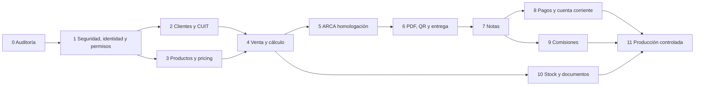

# Fases de implementación

**Estrategia:** integración incremental, aditiva y reversible hasta el momento de una autorización fiscal. No se estiman días; la complejidad es relativa. Cada fase requiere evidencia de entrada/salida y no se activa por calendario.

## 1. Reglas transversales

- rama y entorno de prueba; nunca desarrollar contra producción;
- feature flag por empresa/módulo;
- migraciones expand/backfill/contract separadas;
- backup y restore ensayado antes de cambios de datos;
- pruebas PostgreSQL para locks/constraints, además de SQLite local;
- CI verde, revisión de seguridad y documentación actualizada;
- logs sin secretos/PII innecesaria;
- cada comando crítico lleva correlation ID e idempotency key;
- rollback de código no elimina ni modifica comprobantes autorizados;
- un gate fallido detiene la siguiente fase.

## 2. Dependencias

El alcance inicial puede postergar comisiones/stock avanzado, pero producción no debe conservar el efecto de stock inseguro actual ni un ledger fiscal inconsistente.

## 3. Etapa 0 — auditoría y baseline

**Estado:** análisis documental completado.  
**Complejidad:** ALTA.

### Entrada

- repositorio local disponible;
- autorización sólo para lectura/controles locales.

### Trabajo realizado

- inventario de stack, modelos, vistas, servicios, permisos, API, deploy y backups;
- revisión agregada de datos locales;
- revisión de secretos sin exponer valores;
- verificación oficial ARCA/WSAA/WSFE/Padrón/QR;
- modelo objetivo, riesgos, fases y decisiones pendientes.

### Salida

- ocho documentos bajo `.ai/`;
- P0 identificados;
- `manage.py check` sin errores y migraciones locales aplicadas;
- resultado de suite registrado en `PROJECT_STATUS.md`.

### Rollback

Eliminar sólo los documentos `.ai/` si el usuario los rechaza; no se modificó lógica ni datos.

## 4. Etapa 1 — seguridad, identidad y permisos

**Prioridad:** P0.  
**Complejidad:** ALTA.  
**Dependencia:** decisiones de visibilidad/reasignación para cerrar la matriz, aunque la infraestructura puede comenzar con denegación por defecto.

### 1A. Guardrails inmediatos — implementada parcialmente (22/07/2026)

Implementado en este diff: scopes por empresa para pedidos/clientes/pagos/workspace,
denegación de edición de clientes compartidos fuera de alcance, permiso backend para override
de precio, sanitización de payloads ARCA, exclusión de certificados/claves y pruebas focalizadas.
Pendiente: credenciales literales en scripts con cambios locales previos, errores críticos
silenciados, cobertura total de export/PDF y suite completa estable.

#### Entrada

- aprobación del plan;
- worktree/entorno local y CI;
- inventario de rutas sensibles.

#### Trabajo

1. Crear `ActorContext`/querysets autorizados por empresa.
2. Corregir IDOR en ítems de pedido y edición de clientes.
3. Exigir permiso de precios para overrides; bloquear bajo costo/descuento no definido por defecto.
4. Retirar credenciales literales de scripts y ampliar `.gitignore`.
5. Crear redactor de logs/payloads y eliminar previews de token/sign.
6. Convertir errores silenciados críticos en estados/alertas sin cambiar aún el negocio.
7. Añadir tests de acceso directo y manipulación de POST.

#### Pruebas

- vendedor/operador intenta abrir/modificar IDs de otra empresa;
- usuario con `manage_orders` sin `change_prices` altera `price` en DevTools/API;
- usuario bloqueado y permiso revocado durante sesión;
- intento de acceso a configuración/certificado;
- búsqueda/export/PDF no filtran datos ajenos;
- scanner confirma ausencia de secretos en logs y fixtures;
- regresión de catálogo/pedidos existentes.

#### Salida

- todas las mutaciones sensibles usan objeto ya filtrado por policy;
- matriz mínima de capacidades vigente;
- CI cubre IDOR y price tampering;
- secretos/defaults retirados y rotación documentada;
- sin cambios de esquema fiscal destructivos.

#### Rollback

Feature flag de policies sólo durante despliegue de prueba; rollback de código conserva tablas. No reabrir rutas inseguras en producción: ante incompatibilidad, deshabilitar la acción.

### 1B. Modelo extensible

#### Trabajo

- crear `SellerProfile` y asignar perfiles a usuarios internos existentes;
- introducir roles/permisos/grants con compatibilidad desde grupos actuales;
- registrar `created_by`, `seller`, `approved_by` donde corresponda;
- auditoría append-only con resultado/correlation ID;
- panel de permisos sin acceso a facturas autorizadas.

#### Pruebas/salida

- matriz de roles admin/vendedor/facturación/depósito;
- `propios/todos/asignados` en cada recurso;
- revocación inmediata;
- cambios de roles auditados;
- administrador no puede editar campos legales autorizados.

#### Rollback

Mantener grupos actuales como fuente temporal; dual-read controlado. No borrar asignaciones nuevas.

## 5. Etapa 2 — clientes y consulta fiscal

**Prioridad:** P0/P1.  
**Complejidad:** ALTA.  
**Dependencias:** Etapa 1; decisión de visibilidad y acceso a `ws_sr_constancia_inscripcion`.

### Entrada

- policies de cliente;
- estrategia para los 48 grupos duplicados y 364 faltantes;
- certificado/relación sólo de testing para el servicio, o proveedor elegido.

### Trabajo

- tablas fiscal/comercial y asignación histórica;
- normalizador CUIT + módulo 11;
- reporte/cola de conciliación, sin auto-merge;
- índice único luego de limpiar;
- endpoint backend idempotente “buscar/consultar/confirmar”;
- adaptador `getPersona_v2`, cache, errores parciales y estado manual no verificado;
- fecha/fuente/hash/respuesta normalizada;
- direcciones fiscal, entrega y administrativa separadas;
- `created_by` distinto de vendedor asignado.

### Pruebas

- CUIT válido, dígito inválido, longitud inválida e inexistente;
- CUIT duplicado y carrera de dos creaciones simultáneas;
- servicio caído/timeout/XML parcial/token vencido;
- cambio posterior de condición fiscal;
- cliente asignado a otro vendedor: sólo existencia/datos limitados;
- reasignación autorizada con historia;
- PII ausente de logs;
- testing y producción totalmente separados.

### Salida

- no se puede crear un duplicado bajo concurrencia;
- todos los clientes nuevos distinguen datos fiscales/comerciales;
- consulta real sólo en testing y auditada;
- legacy sigue operando mediante capa de compatibilidad.

### Rollback

Desactivar consulta externa y volver a carga manual `UNVERIFIED`; conservar nuevas tablas. Un índice único se agrega sólo después de conciliación y no se revierte para permitir duplicados.

## 6. Etapa 3 — productos, impuestos y pricing

**Prioridad:** P0.  
**Complejidad:** MUY ALTA.  
**Dependencias:** Etapa 1 y decisiones de precio/IVA/descuentos.

### Entrada

- definición neto vs final de listas actuales;
- política de descuento/bajo costo;
- responsables de completar fiscalidad de productos.

### Trabajo

- unidad, descripción fiscal, moneda, tratamiento y alícuota;
- versionado de precios/costos y vigencias;
- reglas de lista/cliente/canal y límites;
- `PricingService`/`TaxCalculator` backend con `Decimal`;
- snapshot de regla, lista, costo e impuesto;
- importación/previsualización para nuevos campos;
- reporte de productos incompletos; no inventar defaults fiscales silenciosos.

### Pruebas

- lista mayorista/minorista/especial y restringida;
- precio neto/final, IVA múltiple, exento/no gravado;
- descuento dentro/fuera del máximo;
- venta bajo costo con/sin permiso/aprobación;
- precio cambiado mientras se edita una venta;
- manipulación de navegador;
- redondeo por línea/cabecera y monedas;
- import Excel inválido/repetido/rollback.

### Salida

- 100% de productos facturables tiene metadata fiscal validada;
- totales deterministas y reconciliados;
- catálogo público y URLs/imágenes sin regresión;
- costo nunca expuesto sin permiso.

### Rollback

Feature flag de nuevo pricing por empresa. Mantener columnas y versiones; volver temporalmente a lectura legacy sólo para catálogo/no fiscal. No permitir emisión si falta metadata.

## 7. Etapa 4 — venta en borrador y confirmación

**Prioridad:** P1.  
**Complejidad:** ALTA.  
**Dependencias:** clientes y pricing.

### Entrada

- cliente válido, vendedor/actor y productos facturables;
- decisión de presupuestos/pedidos/remitos en alcance inicial;
- decisión de evento de stock, aunque el stock avanzado quede para Etapa 10.

### Trabajo

- evolucionar `Order` con vendedor/creador/aprobador/version/idempotencia;
- snapshot completo de líneas;
- comandos de alta/cambio/cancelación;
- aprobación de excepciones;
- cálculo backend y confirmación final;
- pantalla de facturación con estado visible y anti-doble-submit;
- impedir edición si existe registro final cerrado;
- eliminar el efecto de stock al crear un borrador fiscal.

### Pruebas

- creación/edición concurrente y optimistic lock;
- cliente/lista/producto inactivo;
- precio o condición fiscal cambia antes de confirmar;
- doble clic y replay de idempotency key;
- totales manipulados;
- vendedor distinto de creador;
- permiso revocado entre preview y confirmación;
- catálogo público no afectado.

### Salida

- borrador congelable con hash reproducible;
- toda cifra fiscal proviene del backend;
- ningún borrador afecta ARCA, ledger definitivo ni stock físico.

### Rollback

Desactivar nueva pantalla y conservar borradores. Adaptador read-only permite visualizar snapshots; no convertir automáticamente a formato legacy si pierde información.

## 8. Etapa 5 — ARCA en homologación

**Prioridad:** P0 fiscal.  
**Complejidad:** MUY ALTA.  
**Dependencias:** Etapas 1–4 y decisiones fiscales bloqueantes.

### Entrada

- certificado y POS de homologación;
- secret manager;
- worker/beat/Redis supervisados;
- WSDL/manual revalidados;
- request con `CondicionIVAReceptorId`;
- sin secretos en logs/DB/Sentry.

### Trabajo

- separar `ArcaAuthenticationService`, WSFE, parámetros y recovery;
- sincronizar POS/tipos/IVA/documentos/monedas/tributos;
- máquina de estados completa;
- secuencia/locks PostgreSQL;
- idempotencia durable;
- `FECAESolicitar`, `FECompUltimoAutorizado`, `FECompConsultar`;
- outbox y reconciliador;
- panel de health/errores/acciones seguras;
- runbook de certificado, timeout y divergencia.

### Pruebas

- factura válida, rechazada y con observaciones;
- tipo/POS/IVA/CUIT/total inválidos;
- condición IVA receptor incompatible/ausente;
- token y certificado vencidos;
- caída antes de enviar, durante envío y respuesta perdida;
- recovery de autorizado exacto y mismatch crítico;
- dos vendedores/workers emitiendo simultáneamente;
- número ya usado, task duplicada y doble clic;
- Redis/worker restart y job estancado;
- scanner de secretos y PII.

### Salida

- cada caso incierto se resuelve por consulta, nunca reenvío ciego;
- cero números duplicados en pruebas de carga;
- CAE y registro local reconciliados;
- parámetros/habilitaciones provienen de ARCA;
- homologación aprobada por responsable fiscal/técnico.

### Rollback

Kill switch bloquea `FECAESolicitar` pero deja `FECompConsultar` y reconciliación. No borrar intentos. Revertir código sólo después de resolver todos los estados inciertos.

## 9. Etapa 6 — PDF, QR, descarga y envío

**Prioridad:** P1.  
**Complejidad:** ALTA.  
**Dependencia:** CAE homologado.

### Trabajo

- QR oficial desde snapshot autorizado;
- template versionado y PDF inmutable;
- storage privado/cifrado/versionado;
- hash/tamaño/metadata;
- descarga/impresión/reenvío por permiso;
- email con attachment real y trazabilidad;
- no regenerar ni solicitar CAE al descargar.

### Pruebas

- decodificar QR y comparar todos los campos;
- monedas/cotización/tipo/CAE;
- PDF visual de A/B/C/M/notas en alcance;
- cliente sin email, SMTP caído y reenvío;
- permisos sobre factura propia/ajena;
- artifact eliminado/corrupto: alerta y procedimiento, no CAE nuevo;
- hash estable y template version.

### Salida

- todo autorizado tiene artifact/hash o una alerta reconciliable;
- email adjunta exactamente el artifact;
- QR cumple especificación oficial.

### Rollback

Deshabilitar envío/descarga nueva; conservar artifacts. Una regeneración excepcional crea versión derivada auditada, no sustituye silenciosamente la legal.

## 10. Etapa 7 — notas de crédito y débito

**Prioridad:** P1 obligatorio antes de uso fiscal completo.  
**Complejidad:** MUY ALTA.

### Entrada

- facturas/artefactos/recovery estables;
- permisos y umbrales de aprobación decididos;
- decisión de efectos en stock/comisión.

### Trabajo

- asociaciones explícitas y motivos;
- total/parcial, devolución, precio, cantidad, bonificación y débito;
- control acumulado por línea/importe;
- creador/aprobador;
- flujo ARCA e inmutabilidad idénticos a factura;
- eventos compensatorios.

### Pruebas

- total/parcial y doble nota;
- factura inexistente, de otra empresa/cliente o no autorizada;
- exceder saldo ajustable;
- tipo asociado incompatible;
- timeout/recovery;
- ajuste de cuenta, stock y comisión;
- original permanece intacto.

### Salida

- toda corrección legal se realiza con nota;
- estados `PARTIALLY/FULLY_ADJUSTED` son proyección reconciliable;
- no hay delete/update de factura original.

### Rollback

Bloquear nuevas notas, resolver intentos inciertos y conservar autorizadas. Nunca eliminar una nota emitida.

## 11. Etapa 8 — pagos y cuentas corrientes

**Prioridad:** P1/P2.  
**Complejidad:** MUY ALTA.

### Entrada

- facturas/notas estables;
- condiciones de cuenta, crédito y vencimiento respondidas.

### Trabajo

- Payment, medios combinados y aplicaciones N:N;
- parciales, múltiples facturas, anticipos y saldo a favor;
- ledger append-only, reversos y recibos;
- aging, vencimientos, límites y conciliación;
- remover errores silenciados del ledger existente.

### Pruebas

- pago total, parcial, combinado, excedente y anticipo;
- aplicación a varias facturas;
- pago/factura de empresa o cliente distinto;
- concurrencia sobre saldo pendiente;
- nota posterior al pago;
- anulación/reverso con permiso;
- suma de ledger = estado de cuenta;
- pago no cambia total fiscal.

### Salida

- ledger reconciliable e idempotente;
- ningún CAE sin movimiento esperado;
- pagos y facturas permanecen separados.

### Rollback

Modo sólo lectura y bloqueo de nuevos pagos; conservar movimientos. Los errores se corrigen con reversos, no updates destructivos.

## 12. Etapa 9 — comisiones

**Prioridad:** P2.  
**Complejidad:** MUY ALTA.  
**Dependencia:** decisión de fórmula/momento y eventos fuente estables.

### Trabajo

- reglas versionadas y prioridades;
- evento de comisión con snapshots;
- estados estimada/pendiente/confirmada/pagada/ajustada/anulada;
- ajustes por notas/devoluciones/cobros;
- liquidaciones y permisos propios/todos;
- simulador/shadow antes de afectar liquidaciones.

### Pruebas

- cada fórmula aprobada;
- cambio de regla sin alterar historia;
- factura/cobro/entrega según trigger;
- nota total/parcial;
- vendedor reasignado después de venta;
- margen con costo restringido;
- cierre/reapertura/liquidación y doble evento.

### Salida

- resultados shadow conciliados con cálculo manual;
- regla/version/base visibles en cada evento;
- vendedores sólo ven sus comisiones.

### Rollback

Deshabilitar generación, conservar eventos. Reversar con eventos de ajuste; no recalcular historia silenciosamente.

## 13. Etapa 10 — stock y documentos comerciales

**Prioridad:** P2.  
**Complejidad:** MUY ALTA.  
**Dependencia:** decisión de momento de reserva/descuento y uso de remitos.

### Trabajo

- saldos físico/reservado/disponible por depósito;
- reservas y expiración;
- movimientos append-only y transferencias;
- inventario inicial/reconciliación;
- presupuesto/pedido/remito según decisiones;
- eventos de consumo/devolución y notas;
- `Product.stock` como proyección temporal, no autoridad.

### Pruebas

- reserva concurrente y sin stock;
- confirmar/cancelar/expirar pedido;
- remito/factura según trigger;
- devolución/nota/rotura/ajuste/transferencia;
- dos depósitos y transferencias parciales;
- replay idempotente;
- suma de movimientos = saldo físico/reservado.

### Salida

- saldo reconciliado por depósito;
- ninguna creación de borrador fiscal cambia stock;
- regla aprobada documentada y configurable.

### Rollback

Bloquear movimientos nuevos, conservar ledger y reconstruir proyección. No volver a mutar `Product.stock` manualmente sin reconciliación.

## 14. Etapa 11 — producción controlada

**Prioridad:** gate final.  
**Complejidad:** MUY ALTA.

### Entrada

- todas las decisiones fiscales bloqueantes;
- homologación firmada;
- pruebas de recuperación/carga/seguridad;
- backup cifrado y restore;
- certificado/POS/tipos de producción;
- runbooks y responsables on-call;
- contador/responsable fiscal valida comprobantes/exportación.

### Trabajo

- migración final verificable;
- preflight sin emitir;
- canary de empresa/POS/tipo/usuarios/volumen limitado;
- observación en tiempo real de cola, secuencia, CAE, artifacts y ledger;
- reconciliación ARCA/local;
- expansión gradual y postmortem de cada incidente.

### Pruebas de corte

- `check --deploy`, TLS/cookies/CSP/allowed hosts;
- permisos desde sesión/token y acceso directo;
- worker/beat/Redis restart;
- backup/restore y failover operativo;
- expiración/rotación de certificado simulada;
- kill switch y recovery sin nuevos envíos;
- reportes de CAE, IVA, cuentas y auditoría.

### Salida

- cero estados inciertos sin dueño/alerta;
- reconciliación diaria correcta;
- runbooks probados y métricas dentro de umbrales aprobados;
- autorización explícita para ampliar el canary.

### Rollback

1. activar kill switch de nuevos CAE;
2. mantener workers de consulta/recovery;
3. drenar/inspeccionar outbox y jobs;
4. reconciliar números/autorizaciones;
5. volver UI a sólo lectura/manual no fiscal;
6. restaurar datos sólo si no elimina registros fiscales posteriores; preferir forward-fix;
7. corregir legalmente con notas cuando corresponda.

## 15. Suite obligatoria transversal

### Unitarias

- CUIT módulo 11 y normalización;
- policies y scope;
- pricing/impuestos/redondeo;
- transiciones de estado e inmutabilidad;
- idempotencia y hashes;
- sanitización de logs;
- QR schema;
- ledger/stock/comisiones.

### Integración

- PostgreSQL con locks y constraints;
- Redis/Celery con duplicación/restart;
- contratos SOAP con fixtures oficiales sanitizados;
- object storage/SMTP;
- migraciones desde copia anonimizada.

### End-to-end

- cliente → venta → preview → CAE homologación → PDF → cobro;
- factura → nota parcial/total → saldo/comisión/stock;
- vendedor propio vs ajeno y administrador;
- caída en cada frontera y recuperación.

### Seguridad

- IDOR/BOLA, escalada y sesión revocada;
- price/seller/company tampering;
- CSRF/XSS/inyección/SSRF de webhooks;
- replay/doble ejecución;
- secretos en repositorio, logs, DB, Sentry, responses y artifacts;
- archivos sensibles en static/media/backups.

### No funcionales

- carga concurrente por POS/tipo;
- tiempos de UI sin bloquear worker;
- recuperación masiva;
- restore con RPO/RTO;
- accesibilidad/impresión de PDF;
- métricas y alertas.

## 16. Registro de gates

### Avance local agregado el 24/07/2026

- Etapa 2: observacion comercial, revision de duplicados y tareas por cliente.
- Etapa 3: IVA/stock opcional, centro comercial e historial de productos.
- Etapa 10: base aditiva de saldos por deposito, desactivada hasta conciliacion.
- Seguimiento: bandeja personal/de equipo por empresa y alertas en dashboard.
- Vendedores: estadisticas por asignacion actual; todavia no se usan para
  comisiones ni reemplazan el futuro snapshot historico.

Cada fase debe producir:

- decisión de arquitectura y ADR si cambió una invariante;
- migraciones y reporte dry-run/backfill;
- tests y evidencia CI;
- evaluación de secretos/PII;
- runbook y rollback ensayado;
- feature flags y dueño;
- aprobación técnica, seguridad y —para fiscal/contable— responsable competente.
