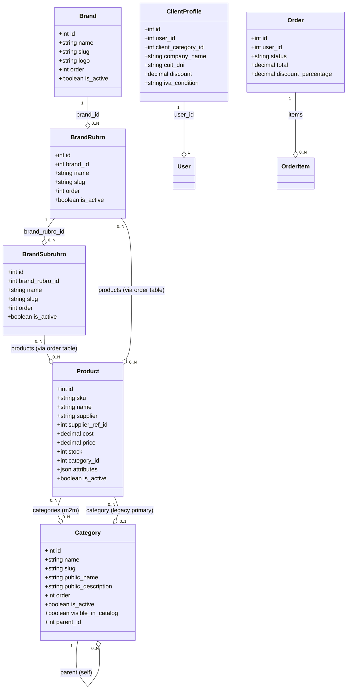

# DOCUMENTACIÓN GENERAL DEL PROYECTO: WEBFLEXS B2B

Este documento consolida la arquitectura técnica, el modelo de datos, las reglas de negocio, los módulos funcionales y las últimas características implementadas en la plataforma **Webflexs**. Sirve como fuente única de verdad para el desarrollo, despliegue y mantenimiento de la aplicación.

---

## 1. Resumen del Proyecto y Objetivos

### 1.1 ¿Qué es Webflexs?
**Webflexs** es una aplicación web B2B operacional diseñada para la gestión comercial y logística de repuestos (enfocada en suspensiones, elásticos y abrazaderas para vehículos pesados y livianos). Funciona como un ERP liviano junto con un catálogo interactivo orientado a clientes mayoristas y personal administrativo interno.

### 1.2 Objetivos Principales
*   **Gestión del Catálogo**: Administración ágil de miles de SKU con jerarquías complejas y múltiples marcas.
*   **Editor Masivo en Grilla**: Planilla de cálculo interactiva en tiempo real para optimizar tareas de actualización de precios, costos, stock, proveedores y categorías.
*   **Flujo Comercial B2B**: Gestión integrada de solicitudes de cuenta, asignación de límites de crédito, pedidos de clientes, registro de pagos y cálculo automático de saldos en cuentas corrientes.
*   **Cotizador de Abrazaderas a Medida**: Algoritmo especializado basado en especificaciones técnicas de metalurgia para cotizar y publicar al catálogo abrazaderas (U-bolts) trefiladas y laminadas en caliente.
*   **Catálogo por Marcas**: Organización comercial alternativa por Marca ➔ Rubro ➔ Subrubro con controles de orden manual y sincronizaciones inteligentes.

---

## 2. Stack Tecnológico y Entornos

### 2.1 Especificaciones Técnicas
*   **Backend**: Python (versión >= 3.12) y Django Framework (versión >= 5.0, < 6.0).
*   **API**: Django REST Framework (DRF >= 3.14).
*   **Frontend**: Plantillas HTML5 de Django (Django Templates), JavaScript Vanilla (ES6+) y CSS3 nativo estructurado de forma modular (sin frameworks adicionales como TailwindCSS por defecto, garantizando flexibilidad y control de renderizado rápido).
*   **Manejo de Tareas en Segundo Plano**: Celery (>= 5.4) y Redis (>= 5.0) para importaciones y regeneración de catálogos en lote. Fallback automático a hilos (`threading`) en entornos de desarrollo sin Redis activo.
*   **Motor de Búsqueda**: Búsqueda avanzada integrada en base de datos. En PostgreSQL usa `TrigramSimilarity` (extensión `pg_trgm`) y en SQLite realiza búsquedas optimizadas mediante `icontains` en múltiples campos indexados.

### 2.2 Entorno Local
*   **Base de Datos**: SQLite (`db.sqlite3` en la raíz).
*   **Ajustes de Optimización SQLite**:
    *   Activación del modo WAL (Write-Ahead Logging) para permitir lecturas concurrentes rápidas durante la escritura.
    *   Aumento de tiempo de espera (`timeout=30.0`) para evitar bloqueos por operaciones simultáneas.
*   **Servidor**: Django Development Server (`python manage.py runserver`).

### 2.3 Entorno de Producción (VPS)
*   **Base de Datos**: PostgreSQL.
*   **Servidor de Aplicación**: Gunicorn.
*   **Servidor Web y Proxy Inverso**: Nginx.
*   **Archivos Estáticos**: WhiteNoise con compresión y almacenamiento en caché de nombres de archivos con hash (ManifestStaticFilesStorage).
*   **Observabilidad**: Monitoreo de logs estructurados en consola y Sentry SDK opcional en entornos productivos.

---

## 3. Estructura del Repositorio y Aplicaciones

El repositorio está estructurado en 5 aplicaciones (apps) Django principales y carpetas de configuración del sistema:

*   **`flexs_project/`**: Contiene la configuración global del proyecto Django.
    *   `settings/`: Ajustes divididos en `base.py` (común), `local.py` (desarrollo) y `production.py` (producción).
    *   `urls.py`: Enrutador global de URLs.
    *   `wsgi.py` / `asgi.py`: Interfaces para el servidor de aplicaciones.
*   **`core/`**: Funcionalidades transversales a todo el sitio.
    *   Página de inicio pública (Home) con secciones promocionales.
    *   Servicios globales de búsqueda avanzada y sugerencias rápidas.
    *   Control de auditoría administrativa y estado de presencia online de administradores.
    *   Middlewares globales de seguridad, aislamiento de sesión y control de inactividad.
    *   Gestor centralizado de tareas en segundo plano e importaciones.
*   **`catalog/`**: Control integral del catálogo de productos y marcas.
    *   Modelos de Categoría (Árbol jerárquico), Atributos de Categoría, Proveedores, Listas de Precios y Productos.
    *   Algoritmos de cotización de abrazaderas a medida (`clamp_quoter.py`).
    *   Modelos de la arquitectura de marcas (`Brand`, `BrandRubro`, `BrandSubrubro`).
    *   Vistas del catálogo público para clientes.
*   **`accounts/`**: Autenticación y cuentas corrientes.
    *   Gestión de perfiles de clientes (`ClientProfile`) vinculados al modelo User de Django.
    *   Solicitudes de cuenta (`AccountRequest`) para clientes mayoristas.
    *   Registro de pagos (`ClientPayment`) e historial de transacciones.
*   **`orders/`**: Gestión del carro de compras y pedidos.
    *   Lógica del carrito de compras (`Cart`, `CartItem`).
    *   Procesamiento de pedidos (`Order`, `OrderItem`).
    *   Historial de estados de pedidos y workflow por roles de usuario.
    *   Productos favoritos de clientes y cotizaciones guardadas.
*   **`admin_panel/`**: Panel de control administrativo y backoffice.
    *   Vistas operativas para clientes, pedidos, pagos e importaciones.
    *   Editor Masivo de Productos en Grilla Excel (Widescreen).
    *   Herramientas de reordenamiento de catálogos tradicionales y catálogos de marcas.

---

## 4. Modelo de Datos Completo (Esquemas de Base de Datos)

A continuación, se detallan los campos y las responsabilidades de los modelos de base de datos definidos en la aplicación:



### 4.1 Aplicación `catalog`

#### Category (Categorías)
Representa la jerarquía de categorías comerciales de la tienda (árbol mediante clave foránea a sí mismo).
*   `name`: Nombre interno de la categoría.
*   `slug`: Ruta única amigable para URLs.
*   `public_name`: Nombre visible para el cliente (comercial).
*   `public_description`: Descripción comercial corta para el catálogo público.
*   `parent`: Clave foránea autorreferenciada (`self`) para estructurar categorías hijas y subcategorías.
*   `order` / `public_order`: Prioridad de clasificación interna y comercial.
*   `is_active`: Estado operativo de la categoría. Si es `False`, desactiva en cascada a sus descendientes.
*   `visible_in_catalog`: Controla si es visible en el catálogo de clientes. Ocultar una categoría oculta en cascada su rama completa.
*   `seo_title` / `seo_description`: Campos opcionales para la optimización en motores de búsqueda (SEO).

#### CategoryAttribute (Atributos Dinámicos de Categoría)
Permite definir atributos específicos de producto por categoría (ej. diámetro, ancho, forma) para la extracción automática desde la descripción.
*   `category`: Clave foránea a `Category`.
*   `name`: Nombre del atributo (ej. "Diámetro").
*   `slug`: Slug del atributo (ej. "diametro").
*   `type`: Tipo de dato (`text`, `number`, `select`).
*   `options`: Opciones disponibles para tipo `select` (separadas por comas).
*   `required` / `is_recommended`: Bandera de obligatoriedad y sugerencia de carga.
*   `regex_pattern`: Expresión regular para extraer automáticamente el valor de este atributo desde la descripción de los productos asociados.

#### Supplier (Proveedores)
Entidad normalizada de proveedores de la plataforma.
*   `name`: Razón social o nombre comercial del proveedor.
*   `normalized_name`: Nombre en mayúsculas y sin espacios duplicados usado para búsquedas precisas de unicidad.
*   `slug`: Identificador único en URLs.
*   `is_active`: Estado activo/inactivo del proveedor.

#### Product (Productos)
El núcleo del catálogo de repuestos de la aplicación.
*   `sku`: Código de referencia único e indexado (soporta slashes e caracteres especiales mediante rutas tipo `path` en Django).
*   `name`: Título del producto.
*   `supplier`: Texto libre con el nombre del proveedor original (para compatibilidad de importaciones).
*   `supplier_ref`: Clave foránea al modelo `Supplier` (proveedor normalizado).
*   `description`: Texto detallado del producto.
*   `cost`: Costo de adquisición neto en base de datos.
*   `price`: Precio base de venta al público (antes de descuentos o tarifas específicas).
*   `stock`: Cantidad física disponible.
*   `category`: Clave foránea a `Category` (Categoría principal/canónica para vistas clásicas y exportaciones).
*   `categories`: Relación ManyToMany con `Category` para asociar un producto a múltiples categorías simultáneamente.
*   `image`: Ruta al archivo de imagen cargado.
*   `attributes`: JSON que guarda atributos clave-valor específicos del producto (ej. `{"diametro": "5/8", "largo": "180"}`).
*   `is_active`: Bandera de estado activo. Los productos inactivos están excluidos del catálogo público.

#### CategoryProductOrder (Ordenación Manual de Productos en Categorías)
*   `category`: Clave foránea a `Category`.
*   `product`: Clave foránea a `Product`.
*   `block_label` / `block_order`: Agrupadores para subdividir listados de categorías en bloques temáticos.
*   `sort_order`: Índice numérico entero para ordenar los productos dentro de la categoría.

#### ClampSpecs (Especificaciones de Abrazadera)
Especificaciones metalúrgicas estructuradas acopladas mediante relación uno a uno a `Product`.
*   `product`: Clave foránea 1-to-1 a `Product`.
*   `fabrication`: Tipo de fabricación (`TREFILADA`, `LAMINADA`, `FORJADA`).
*   `diameter`: Diámetro expresado en pulgadas o milímetros (ej. `5/8`, `7/8`).
*   `width`: Ancho en milímetros.
*   `length`: Largo en milímetros.
*   `shape`: Forma de la abrazadera (`PLANA`, `CURVA`, `SEMICURVA`).
*   `parse_confidence`: Nivel de confianza del parser automático al extraer estas medidas desde el texto de descripción.
*   `manual_override`: Si está activo, impide que el parser automático sobrescriba cambios ingresados manualmente por el administrador.

#### ClampMeasureRequest (Solicitudes de Abrazaderas a Medida)
Historial de solicitudes creadas por clientes para medidas personalizadas no listadas en el catálogo.
*   `client_user` / `company`: Usuario que la solicita y empresa activa asociada.
*   `client_name` / `client_email` / `client_phone`: Datos de contacto provistos por el usuario.
*   `clamp_type`: Tipo de abrazadera solicitada (`trefilada` o `laminada`).
*   `is_zincated`: Bandera que indica si requiere proceso de zincado.
*   `diameter` / `width_mm` / `length_mm` / `profile_type`: Especificaciones técnicas deseadas.
*   `quantity`: Cantidad de unidades requeridas.
*   `generated_code`: Código SKU sugerido por el algoritmo (formato `ABL` o `ABT`).
*   `linked_product`: Enlace a `Product` una vez que el administrador decide aprobar la solicitud e incorporarla como artículo regular.
*   `dollar_rate` / `steel_price_usd` / `supplier_discount_pct` / `general_increase_pct`: Factores económicos vigentes al momento del cálculo técnico.
*   `base_cost` / `estimated_final_price`: Costo base calculado y precio de lista propuesto.
*   `selected_price_list` / `confirmed_price`: Lista de precio seleccionada por el cliente y precio final acordado por el administrador.
*   `status`: Estado del ciclo de vida de la solicitud (`pending`, `in_review`, `quoted`, `rejected`, `completed`).

#### Brand (Marcas)
*   `name`: Nombre de la marca (ej. `FORD`, `MERCEDES-BENZ`).
*   `slug`: Slug único autogenerado.
*   `logo`: Archivo de imagen de logotipo comercial.
*   `banner`: Imagen destacada para el catálogo de clientes.
*   `order`: Orden de clasificación manual.
*   `is_active`: Flag de estado activo.

#### BrandRubro (Rubros de Marca)
Categorías de segundo nivel ligadas a una marca específica (ej. `FORD ➔ BUJES`).
*   `brand`: Clave foránea a `Brand`.
*   `name`: Nombre del rubro.
*   `slug`: Slug único contextual.
*   `icon_emoji`: Emoji o código de ícono descriptivo para renderizado en frontend (ej. `⚙️`, `📂`).
*   `badge_text` / `badge_color`: Mensaje promocional y color estético del badge (ej. `orange`, `blue`).
*   `order`: Orden manual.
*   `is_active`: Bandera de estado activo.
*   `products`: Relación ManyToMany con `Product` a través de `BrandRubroProductOrder` para habilitar un catálogo directo de dos niveles.

#### BrandSubrubro (Subrubros de Marca)
Categorías de tercer nivel ligadas a un rubro de marca (ej. `FORD ➔ BUJES ➔ BUJES DE EJE`).
*   `brand_rubro`: Clave foránea a `BrandRubro`.
*   `name`: Nombre del subrubro.
*   `slug`: Slug único.
*   `helper_categories`: Relación ManyToMany con `Category` (Categorías ayudantes) que alimenta automáticamente a este subrubro con productos que pertenecen a la categoría elegida y contienen el nombre de la marca.
*   `products`: Relación ManyToMany con `Product` a través de `BrandSubrubroProductOrder`.
*   `order` / `is_active`: Orden de visualización y bandera de habilitación.

### 4.2 Aplicación `accounts`

#### ClientCategory (Categorías Operativas de Clientes)
*   `name`: Nombre de la categoría de cliente (ej. "Mayorista A").
*   `slug`: Slug de la categoría.
*   `default_sale_condition`: Condición por defecto (`cash` o `account`).
*   `allows_account_current`: Habilita o no compras a crédito/cuenta corriente.
*   `account_current_limit`: Monto máximo permitido de deuda acumulada.
*   `discount_percentage`: Descuento global aplicado por pertenecer a esta categoría.
*   `price_list_name`: Nombre de la lista de precio por defecto asociada a esta categoría.

#### ClientProfile (Perfiles Extendidos de Cliente)
*   `user`: Clave foránea 1-to-1 al modelo User nativo de Django.
*   `client_category`: Clave foránea a `ClientCategory`.
*   `company_name`: Razón social de la empresa B2B.
*   `cuit_dni` / `document_type` / `document_number`: Identificadores fiscales.
*   `iva_condition`: Condición fiscal de IVA (`responsable_inscripto`, `monotributista`, etc.).
*   `province` / `fiscal_province` / `fiscal_city` / `address` / `fiscal_address` / `postal_code`: Información geográfica y fiscal de facturación.
*   `phone`: Teléfonos comerciales.
*   `discount`: Descuento comercial directo (sobreescribe al descuento de `ClientCategory` si es mayor a cero).

#### ClientPayment (Registro de Pagos)
*   `client_profile`: Clave foránea a `ClientProfile`.
*   `amount`: Importe total cobrado.
*   `payment_method`: Canal de cobro (transferencia, efectivo, cheque, etc.).
*   `order`: Clave foránea opcional a un pedido específico (`Order`).
*   `is_cancelled`: Flag para anulación lógica de pagos sin borrar el registro de auditoría.

---

## 5. Reglas de Negocio Críticas

### 5.1 Visibilidad de Catálogo
Un producto es visible para los clientes si y solo si:
1.  El producto tiene `is_active=True`.
2.  Al menos una de sus categorías asignadas (`Product.categories`) está activa (`is_active=True`) y marcada como visible en catálogo (`visible_in_catalog=True`).
3.  *Excepción*: En listados administrativos del panel, se permite listar productos sin categoría ("Huérfanos") para facilitar su categorización en lote.

### 5.2 Determinación de Precios de Venta (B2B)
El precio de venta final de un producto para un cliente autenticado se resuelve de la siguiente forma:
1.  **Resolución de Lista de Precios**:
    *   Se identifica la lista de precio asociada a la categoría de cliente (`ClientCategory.price_list_name`).
    *   Se busca si existe un valor específico para el producto en esa lista (`PriceListItem`). Si existe, se adopta como precio base de lista.
    *   *Fallback*: Si no existe, o el cliente no está autenticado, se utiliza el precio directo del modelo del producto (`Product.price`).
2.  **Resolución de Descuento Efectivo**:
    *   Se evalúa el descuento individual del perfil de cliente (`ClientProfile.discount`).
    *   Si es `0`, se adopta el descuento de la categoría de cliente (`ClientCategory.discount_percentage`).
    *   El descuento efectivo calculado se resta del precio base de lista para obtener el **Precio Final**.

### 5.3 Cuenta Corriente y Saldo de Clientes
El saldo de cuenta corriente de un cliente en un momento dado se calcula dinámicamente mediante la siguiente fórmula:

$$\text{Saldo} = \sum (\text{Total de Pedidos Confirmados/Operativos}) - \sum (\text{Total de Pagos Registrados y No Anulados})$$

*   **Pedidos Operativos**: Incluye todos los pedidos cuyo estado sea `confirmed`, `preparing`, `shipped` o `delivered`. Los pedidos en estado `draft` (borrador) o `cancelled` (cancelados) están excluidos del cálculo.
*   **Pagos Operativos**: Todos los `ClientPayment` de dicho perfil donde `is_cancelled=False`.
*   **Límites de Cuenta Corriente**: Si el cliente intenta cerrar un pedido con condición de venta de cuenta corriente y el monto del pedido supera su límite disponible (`account_current_limit` menos el saldo deudor actual), la transacción se bloquea en checkout.

### 5.4 Flujo de Estados de Pedidos por Rol
La aplicación implementa colas de tareas diferenciadas por rol de usuario para coordinar la logística interna:

| Rol de Usuario | Estados Visibles | Transiciones Permitidas |
| :--- | :--- | :--- |
| **Administrador** | Todos los estados | Todas las transiciones válidas de máquina de estados |
| **Ventas / Operadores** | `draft`, `confirmed` | `draft ➔ confirmed`<br>`draft ➔ cancelled`<br>`confirmed ➔ cancelled` |
| **Depósito / Logística** | `confirmed`, `preparing`, `shipped` | `confirmed ➔ preparing`<br>`preparing ➔ shipped` |
| **Facturación / Cobros** | `shipped`, `delivered` | `shipped ➔ delivered` |

---

## 6. Módulo de Abrazaderas a Medida (Cotizador Técnico)

El cotizador técnico de abrazaderas calcula costos y listas de precios basándose en el peso físico de las materias primas y recargos por procesos metalúrgicos.

### 6.1 Tabla de Peso Teórico por Diámetro (`CLAMP_WEIGHT_MAP`)
El peso por metro de las barras de acero utilizadas varía según su diámetro en pulgadas (o milímetros equivalentes):
*   `7/16`": 0.760 kg/m
*   `1/2`": 0.993 kg/m
*   `9/16`": 1.258 kg/m
*   `5/8`": 1.553 kg/m
*   `3/4`": 2.236 kg/m
*   `7/8`": 3.043 kg/m
*   `1`": 3.975 kg/m
*   `18` mm: 1.920 kg/m
*   `20` mm: 2.500 kg/m
*   `22` mm: 3.043 kg/m
*   `24` mm: 3.800 kg/m

### 6.2 Fórmulas de Costo y Venta
1.  **Largo de Barra Requerido (Lbar)**:
    Se calcula sumando el largo de las dos piernas de la abrazadera, el ancho de la base, y un excedente constante para el roscado y doblado:
    $$L_{bar} = (2 \times \text{Largo}) + \text{Ancho} + \text{Constante de Doblado}$$
2.  **Peso de la Abrazadera**:
    $$Peso = L_{bar} \times Peso_{\text{diámetro}}$$
3.  **Costo de Materia Prima (Acero)**:
    $$Costo_{\text{acero}} = Peso \times \text{Precio Acero USD} \times \text{Cotización Dólar}$$
4.  **Costo de Doblado/Formación**:
    Se aplica según la forma seleccionada del perfil:
    *   `CURVA`: $+\$0$ (Base)
    *   `SEMICURVA`: $+\$10$
    *   `PLANA`: $+\$20$
5.  **Costo de Zincado (Tratamiento Superficial)**:
    Si la bandera `is_zincated` es `True`, se aplica un recargo multiplicativo del **20%** sobre el costo total acumulado del acero:
    $$Costo_{\text{base}} = (Costo_{\text{acero}} + Costo_{\text{forma}}) \times 1.20$$
6.  **Descuento de Proveedor**:
    Se aplica el descuento del proveedor ingresado sobre el costo total.
7.  **Multiplicadores por Lista de Venta**:
    A partir del costo base calculado, se proyectan los precios de venta utilizando coeficientes comerciales fijos:
    *   **Lista 1**: Costo $\times 1.4$
    *   **Lista 2**: Costo $\times 1.5$
    *   **Lista 3**: Costo $\times 1.6$
    *   **Lista 4**: Costo $\times 1.7$
    *   **Facturación (Oficial)**: Costo $\times 2.0$

---

## 7. Características Avanzadas del Editor Masivo (Grid Excel-like)

El Editor Masivo de Productos proporciona una planilla Widescreen interactiva para realizar actualizaciones rápidas sobre el catálogo:

### 7.1 Panel Superior de Acciones y Filtros
*   **Pestañas de Clasificación Rápida**:
    *   `Todos`: Muestra el listado de productos completo.
    *   `⚠️ Sin Categoría`: Filtra productos con `category_id` vacío.
    *   `⚙️ Sin Categoría (TRILER)`: Muestra productos huérfanos pertenecientes al proveedor de elásticos TRILER (Mecánico Oce).
*   **Buscador Integrado**: Permite buscar productos por SKU, nombre y proveedor en tiempo real.
*   **Autocompletado de Asignación en Lote**: Un selector jerárquico personalizado que filtra y busca categorías en vivo y permite asignarlas de forma masiva a todos los ítems seleccionados con un solo clic.

### 7.2 Funciones de Edición Inline en la Grilla
*   **Celdas Editables**: Edición rápida de SKU, Nombre, Costo, Precio, Stock y Categorías mediante doble clic o seleccionando la celda y presionando la tecla `Enter`.
*   **Buscador Predictivo Autocompletable de Categoría en Celda**:
    *   Al editar la celda de Categoría, se muestra un buscador predictivo interactivo que despliega el árbol de categorías con sangrías y símbolos de nivel (`↳ `).
    *   Permite navegar las opciones con las flechas del teclado (`ArrowUp`/`ArrowDown`), seleccionar con `Enter` y cancelar con `Esc`.
    *   Incluye la opción `➕ Crear categoría: [Nombre]` que abre un modal oscuro premium para registrar e incorporar una categoría nueva en vivo vía AJAX.
*   **Buscador de Proveedores Custom**:
    *   Reemplaza el datalist nativo de los navegadores por una interfaz autocompletable limpia.
    *   Si el proveedor escrito no existe, ofrece la opción de `➕ Crear nuevo: [Proveedor]`, registrándolo automáticamente en base de datos.
*   **Recálculo de Márgenes en Vivo**: Al modificar costos o precios, la celda de margen se actualiza automáticamente calculando la rentabilidad neta en porcentaje.

### 7.3 Panel de Categorías Lateral (Categories Sidebar)
*   **Barra de Asignación Rápida**: Panel deslizable en la parte derecha de la pantalla que contiene la jerarquía completa de categorías en árbol con selectores colapsables (`▼` / `▶`).
*   **Pestaña Dinámica de Conteo**: Al marcar múltiples checkboxes de productos en la grilla, la pestaña parpadea y cambia su etiqueta a `📁 ASIGNAR (N)` (donde N es el número de artículos seleccionados). Al hacer clic en cualquier categoría del árbol lateral, se asigna dinámicamente esa categoría a todos los productos marcados vía AJAX.
*   **Desvanecimiento (Fade-out) en el listado de Sin Categoría**: Al asignarles categoría de forma masiva, las filas de los productos correspondientes se ocultan suavemente del DOM mediante transiciones CSS.

### 7.4 Auto-Sugerencias de Categorías Inteligentes
*   **Motor Predictivo en Frontend**: Analiza y tokeniza el nombre de los productos comparándolos con las categorías disponibles.
*   **Píldora Inteligente**: Si un producto sin categoría tiene alta coincidencia con una categoría existente, se renderiza una píldora `💡 Sugerido: [Categoría]` dentro de su celda. Al hacer clic, la categoría se asocia y guarda automáticamente.

### 7.5 Barra de Scroll Vertical a la Izquierda (Left-Side Scrollbar)
*   **Ubicación Premium**: La tabla posee un límite de altura máximo (`68vh`) con cabeceras fijas (`position: sticky`).
*   **Scroll en Margen Izquierdo**: Configurado mediante propiedades CSS (`direction: rtl` en el contenedor y `direction: ltr` en la tabla) para ubicar el riel de scroll en la izquierda, quedando a un milímetro de las casillas de verificación de filas, mejorando notablemente la ergonomía del editor.

---

## 8. Arquitectura y Gestión del Catálogo de Marcas

El catálogo por marcas es independiente del catálogo tradicional por categorías y organiza los artículos de manera comercial y visual:

### 8.1 Niveles de Organización
1.  **Marca (`Brand`)**: Identidad comercial de vehículos (ej: `FORD`, `SCANIA`). Posee logo oficial e información SEO.
2.  **Rubro (`BrandRubro`)**: Familia de repuestos (ej: `BUJES`, `ELÁSTICOS`).
3.  **Subrubro (`BrandSubrubro`)**: Tipo específico (ej: `BUJES DE BRONCE`).

### 8.2 Interfaz SPA para Asociación de Productos
Las pantallas administrativas de gestión de productos para rubros y subrubros incorporan comportamiento interactivo SPA:
*   **Buscador AJAX en Vivo**: El panel derecho busca productos por SKU y nombre a medida que escribe el administrador (debounce de 300ms) sin recargar la página.
*   **Indicador de Asociación (✓ Asociado)**: Si un producto en los resultados ya está en el listado, se muestra un badge verde y el botón de agregar se deshabilita para evitar duplicaciones.
*   **Paginación Incremental ("Cargar más")**: Los resultados de búsqueda se paginan del lado del servidor de 30 en 30 para optimizar el rendimiento de base de datos.
*   **Previsualización de Impacto en Cargas Masivas**: Al elegir una categoría general de ayuda, el sistema consulta un endpoint de previsualización que calcula cuántos productos hay en total, cuántos ya están asociados y cuántos se añadirán netamente.
*   **Inserción Animada y Overlay de Carga**: Durante las inserciones en lote, se muestra un spinner de pantalla completa (`#loadingOverlay`). Al finalizar, las nuevas filas se agregan al listado izquierdo mediante animaciones de aparición fluida (`slide-down`/`fade-in`).

### 8.3 Ordenamiento Físico y Teclado Numérico
*   **Drag & Drop Nativo HTML5**: Permite arrastrar físicamente las filas de la tabla izquierda para ordenar la prioridad comercial de los productos en el catálogo de clientes.
*   **Input Numérico Directo**: La columna de posición posee cajas de texto numéricas editables. Al editar una posición y presionar `Enter`, la fila se traslada de forma inmediata a la nueva ubicación jerárquica en el DOM, se re-indexan las filas vecinas y se aplica un efecto de destello naranja ("flash highlight") para confirmar visualmente el movimiento antes de guardar los cambios de forma definitiva.

### 8.4 Reglas del Catálogo Público por Marca
*   **Ocultamiento de Categorías Vacías**: Para evitar una experiencia de navegación frustrante con páginas en blanco, los rubros y subrubros que no posean productos activos asociados no se renderizan en el portal de clientes.
*   **Visualización en Grilla e Interfaz Compacta**: La landing de marcas presenta los rubros como tarjetas oscuras con emojis/íconos configurables y badges comerciales. Al seleccionar un rubro, los productos se presentan en un catálogo de tarjetas ultra-compacto diseñado para visualizar múltiples artículos de forma simultánea.
*   **Buscador Rápido por Marca (JS)**: Barra de búsqueda superior que filtra los productos en tiempo real ocultando del DOM los elementos que no coincidan, actualizando el contador de resultados de forma instantánea.

---

## 9. SEO y Metadatos de Estructura de Catálogo

Para potenciar el posicionamiento web y facilitar la aparición de Fragmentos Enriquecidos (Rich Snippets) en Google, la aplicación inyecta breadcrumbs estructurados y bloques de metadatos JSON-LD dinámicos:

### 9.1 Breadcrumbs Visuales
Se muestra la jerarquía exacta de navegación en el catálogo del cliente:
*   En marcas: `Inicio ➔ Marcas ➔ [Nombre Marca] ➔ [Rubro] ➔ [Subrubro]`
*   En categorías: `Inicio ➔ [Categoría Padre] ➔ [Categoría Hija]`

### 9.2 JSON-LD Schema.org
En las páginas de marca, se autogenera un script con metadatos estructurados en formato JSON:
1.  **BreadcrumbList**: Define los pasos jerárquicos exactos y sus URLs absolutas para que Google renderice la ruta en las búsquedas.
2.  **Brand**: Declara la marca del fabricante asociada al catálogo visualizado.
3.  **ItemList / Product**: Enlista todos los productos renderizados en la página con sus nombres, SKUs, descripciones, imágenes oficiales, precios vigentes de lista y disponibilidad de stock.

---

## 10. Seguridad y Auditoría

La plataforma cuenta con un esquema de seguridad robusto a nivel de middleware y bases de datos:

### 10.1 Middlewares de Seguridad
*   `RequestIDMiddleware`: Genera un identificador único por petición (`X-Request-ID`), el cual se inyecta en los headers HTTP y se propaga en los archivos de logs del servidor para facilitar auditorías y diagnósticos.
*   `SessionIdleTimeoutMiddleware`: Controla la inactividad de los usuarios. Si no se registran peticiones en un lapso configurable de segundos (definido por `SESSION_IDLE_TIMEOUT_SECONDS`), la sesión se cierra automáticamente.
*   `AuditRequestContextMiddleware`: Provee un contexto de hilo local (`thread-local`) para asociar de manera transparente qué usuario está realizando modificaciones en los modelos de Django.
*   `AuthSessionIsolationMiddleware`: Inyecta cabeceras `Cache-Control: no-store, private` y `Pragma: no-cache` en vistas autenticadas para impedir que datos sensibles del cliente queden almacenados en cachés públicas o del navegador.
*   `UserActivityMiddleware`: Registra el estado de conexión de los administradores y previene consultas redundantes mediante almacenamiento en caché (Throttle).

### 10.2 Lockout de Login (Bloqueo de Cuenta)
Para evitar ataques de fuerza bruta, la pantalla de autenticación bloquea los intentos fallidos por dirección IP y nombre de usuario:
*   `LOGIN_MAX_FAILED_ATTEMPTS`: Cantidad máxima de intentos fallidos antes del bloqueo.
*   `LOGIN_LOCKOUT_SECONDS`: Duración en segundos del periodo de bloqueo.
*   `LOGIN_ATTEMPT_WINDOW_SECONDS`: Ventana de tiempo en segundos para registrar intentos fallidos.

### 10.3 Restricción de Superadmin Operativo (`josueflexs`)
Existe una regla de privilegios exclusiva en el sistema:
*   El usuario administrador `josueflexs` es considerado el superadministrador principal.
*   Ciertas acciones de alta criticidad (ej. eliminación de clientes, alteración de configuraciones fiscales y modificaciones de auditoría) están reservadas exclusivamente para este usuario y se bloquean o validan de forma estricta para el resto del personal con perfil `staff`.

---

## 11. Runbook y Comandos Operativos

### 11.1 Ejecución en Entorno Local (Windows PowerShell)

Para iniciar el entorno de desarrollo local con los ajustes correspondientes:

```powershell
# Acceder a la carpeta del proyecto
cd C:\Users\Brian\Desktop\webflexs

# Activar el entorno virtual de Python
.\venv\Scripts\activate

# Configurar variables de entorno y base de datos local
$env:DJANGO_SETTINGS_MODULE="flexs_project.settings.local"

# Aplicar migraciones pendientes
python manage.py migrate

# Ejecutar el servidor local en puerto 8000
python manage.py runserver
```

### 11.2 Ejecución de la Suite de Pruebas Unitarias

Para correr las pruebas unitarias del catálogo de marcas y del panel de administración:

```powershell
# Correr únicamente pruebas de la grilla del Editor Masivo
python manage.py test admin_panel.tests.ProductGridEditorViewTests

# Correr únicamente pruebas del catálogo de marcas
python manage.py test catalog.tests_brands

# Correr la suite de pruebas completa del proyecto
python manage.py test
```

### 11.3 Script de Inicialización y Poblado de Marcas (Internet API)
Para realizar descargas automatizadas de logotipos de fabricantes desde internet y cargarlas en la base de datos local, se cuenta con el script interactivo `populate_brands_internet.py` en la carpeta `scratch/`. Para ejecutarlo de forma aislada:

```powershell
python scratch/populate_brands_internet.py
```
*Este script realiza consultas REST seguras a CDNs de logotipos y almacena las imágenes físicas en el directorio `media/brands/logos/` enlazándolas al modelo `Brand`.*

---

## 12. Historial de Solución de Problemas (Troubleshooting)

### 12.1 Error en bucles de caracteres en categorías de Django Templates
*   **Síntoma**: Los nombres de las categorías jerárquicas o breadcrumbs se renderizaban carácter por carácter separados por flechas (ej. `A ➔ C ➔ E ➔ R ➔ O` en lugar de `ACERO`).
*   **Causa**: Django Templates itera de forma nativa los strings como listas de caracteres individuales si se les pasa un string directo en un bucle ``.
*   **Solución**: Se modificaron los helpers del backend (`build_category_options`) para compilar y retornar un listado explícito de objetos de ruta pre-parseados (`parent_path_list`), logrando iteraciones coherentes en el frontend.

### 12.2 Menús de autocompletado ocultos o recortados en celdas de la grilla
*   **Síntoma**: Los desplegables autocompletables de las celdas quedaban truncados verticalmente por debajo de la fila en edición.
*   **Causa**: Las celdas de la tabla (`td`) poseen la regla CSS `overflow: hidden` nativa para evitar que texto largo distorsione el tamaño de la grilla.
*   **Solución**: Se inyectaron reglas CSS específicas aplicadas dinámicamente al entrar en edición (`.spreadsheet-cell.editing`) forzando `overflow: visible !important` y elevando el `z-index` para posicionar el dropdown sobre el resto de las filas.

### 12.3 Desbordamiento y superposición del botón B2B Company Switcher
*   **Síntoma**: En resoluciones de pantalla medianas (901px a 1200px), el botón de cambio de empresa activa del cliente B2B se superponía con los menús de navegación, leyéndose recortado como `"MBIAR"`.
*   **Causa**: Sobrecarga de enlaces en el menú de navegación principal y flujo de alineación derecha.
*   **Solución**: Se reubicó el selector de empresa activa a la barra superior del encabezado (`.header-top`) en pantallas de escritorio (>900px) y se configuró su visibilidad condicional para móviles, liberando espacio en el menú y optimizando la interfaz.

---

Este documento refleja fielmente la totalidad de la estructura del proyecto y sirve de base sólida para la continuidad operativa de la plataforma.
